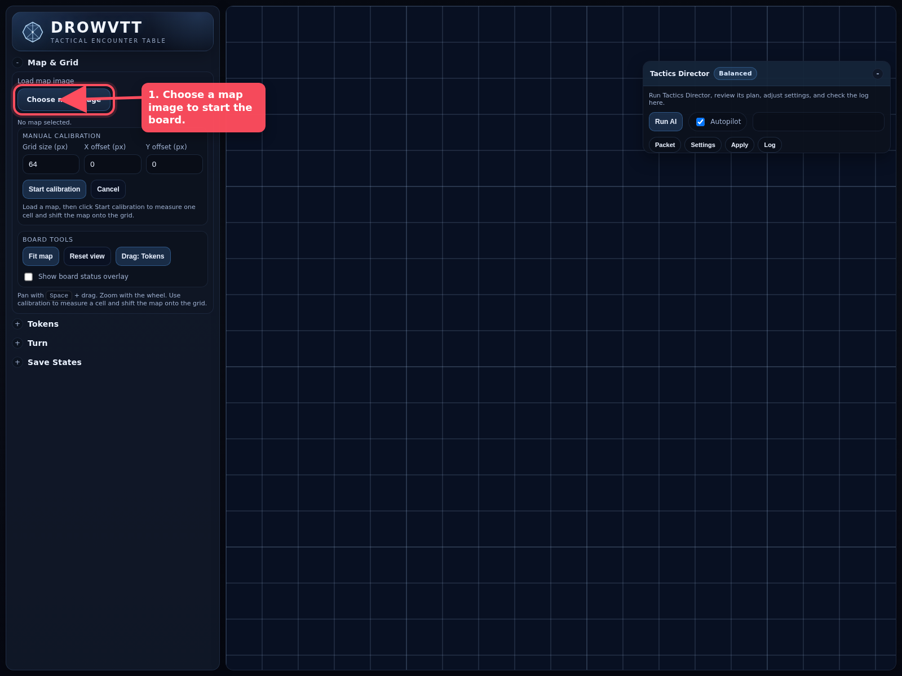
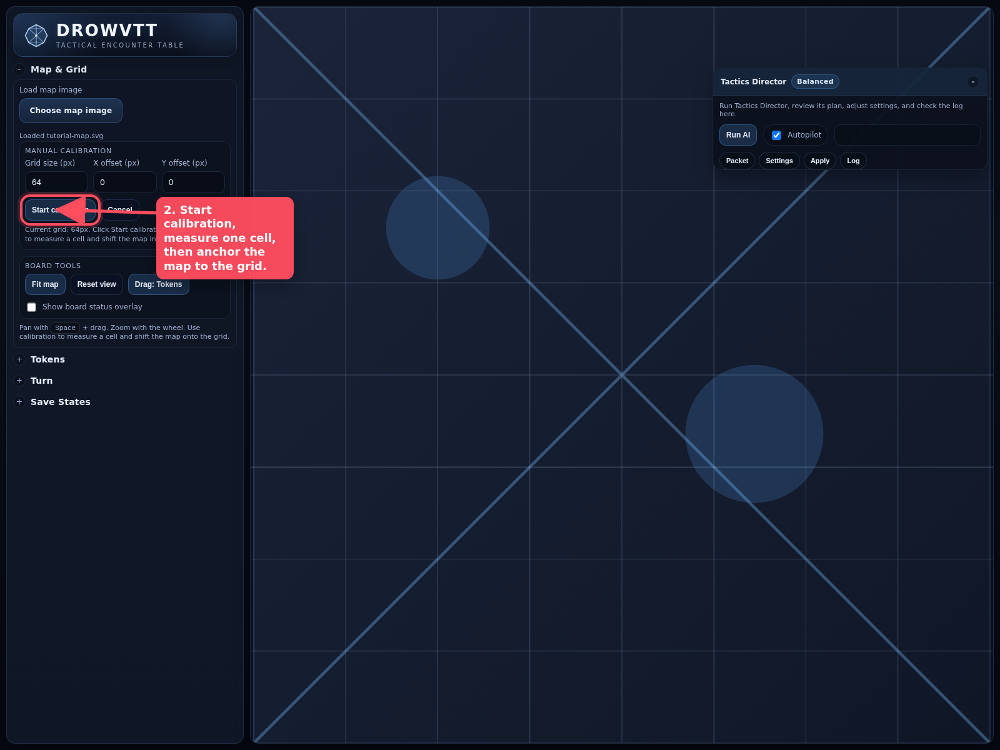
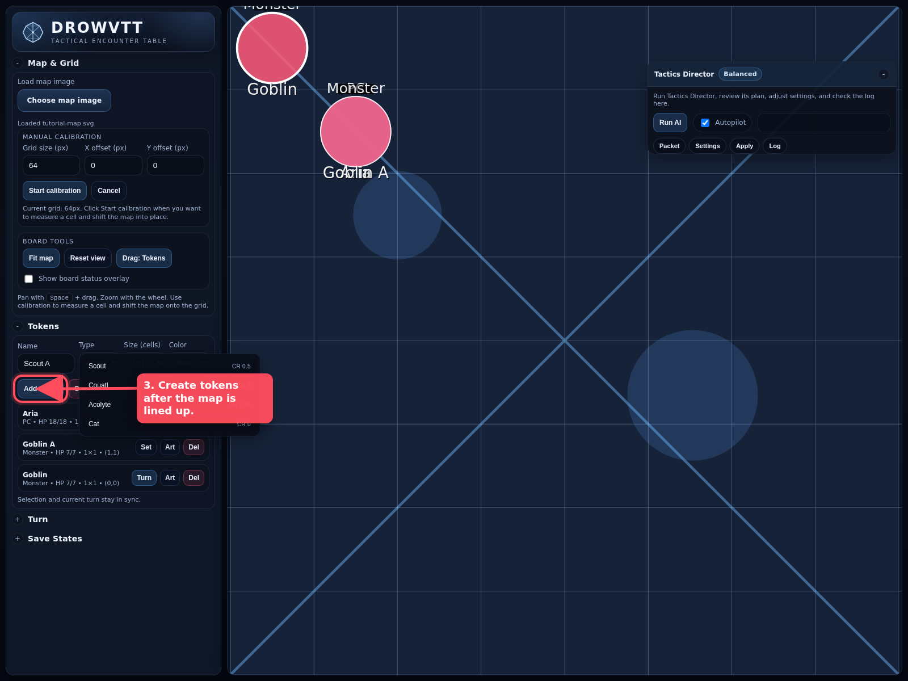
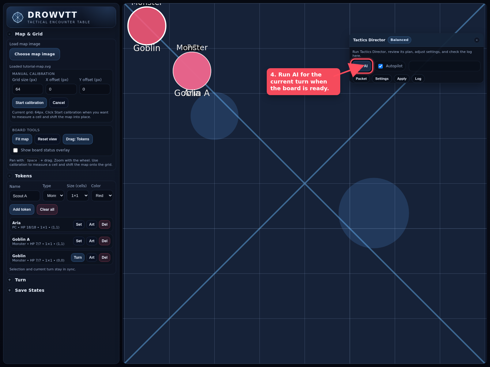
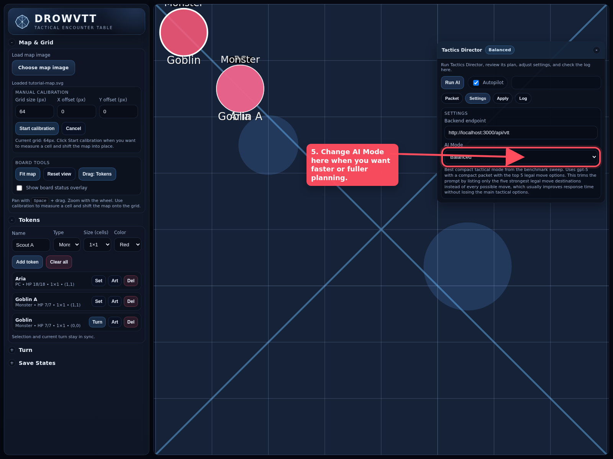

# DrowVTT Tutorial

This tutorial covers the core loop of DrowVTT from first principles:

1. add a map
2. calibrate the map to the grid
3. create tokens
4. run AI for the current turn
5. switch AI mode when you want faster or deeper planning

If you understand those five ideas, you can run most encounters in the app.

## 1. Add a Map

Your map image is just the visual layer under the combat grid. The grid itself is the real game board, so the first goal is simply to load an image that you can line up to that grid.

What to do:

1. Open `Map & Grid`.
2. Click `Choose map image`.
3. Pick the image file you want to use.

What matters:

- The image does not need to be perfectly aligned when it loads.
- You will fix the alignment during calibration.

## 2. Calibrate the Map

Calibration teaches DrowVTT how your map image lines up with the gameplay grid. Think of it as matching one map cell to one VTT cell, then shifting the image into place.

What to do:

1. Click `Start calibration`.
2. Click two points on the map that span exactly one grid cell on the image.
3. Click a clear grid intersection or anchor point on the map.
4. Click where that same point should land on the DrowVTT grid.

What the fields mean:

- `Grid size (px)` is the measured size of one grid cell on the map image.
- `X offset (px)` shifts the map left or right.
- `Y offset (px)` shifts the map up or down.

First principle:

- The combat grid drives movement and rules.
- The map image is there to visually match that grid.
- If something looks off, calibrate again until one map square cleanly matches one board square.

## 3. Create Tokens

Tokens are the pieces that actually participate in combat. Add the creatures you need after the map is lined up.

What to do:

1. Open `Tokens`.
2. Enter a creature name.
3. Choose `Type`, `Size`, and `Color`.
4. Click `Add token`.

Good to know:

- You can use SRD creature names and DrowVTT will autocomplete them.
- Token size matters because it affects how the creature occupies grid space.
- The selected current-turn creature is what the AI will act on.

## 4. Run AI

Once the board is set and the current turn belongs to the creature you want to automate, you can ask the AI to act.

What to do:

1. Make sure the correct creature is the current turn token.
2. Open `Tactics Director`.
3. Click `Run AI`.

How to think about it:

- The AI reads the current board state, token positions, movement limits, and statblock context.
- It plans for the current turn only.
- If `Autopilot` is on, DrowVTT will apply the response automatically.
- If `Autopilot` is off, you can inspect the JSON output first and apply it manually.

## 5. Change AI Mode

AI Mode changes how much information and reasoning the backend uses for a turn.

What to do:

1. Open the `Settings` tab in `Tactics Director`.
2. Change `AI Mode`.

When to use each one:

- `Balanced`: best default for normal play
- `Fast`: use when you want lower latency and lighter planning
- `Full`: use when you want the richest turn context and are willing to wait longer

First principle:

- Use the lightest mode that still produces good turns for your encounter.
- Faster modes feel better in routine combat.
- Fuller modes are better when the tactical state is crowded or subtle.

## Recommended Workflow

For a smooth session, use this order every time:

1. load the map
2. calibrate it
3. add tokens
4. verify the current turn
5. run AI
6. switch AI mode only when you need different speed or depth

## Quick Troubleshooting

If the board feels wrong:

- If movement looks visually off, recalibrate the map.
- If a creature occupies the wrong footprint, check token size.
- If AI feels too slow, switch from `Full` to `Balanced` or `Fast`.
- If AI seems to act for the wrong creature, confirm the current turn token first.
