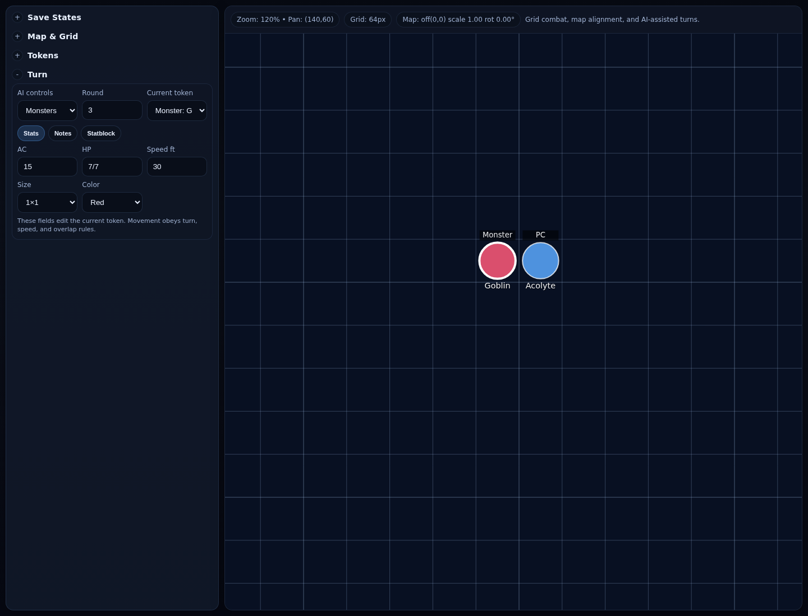
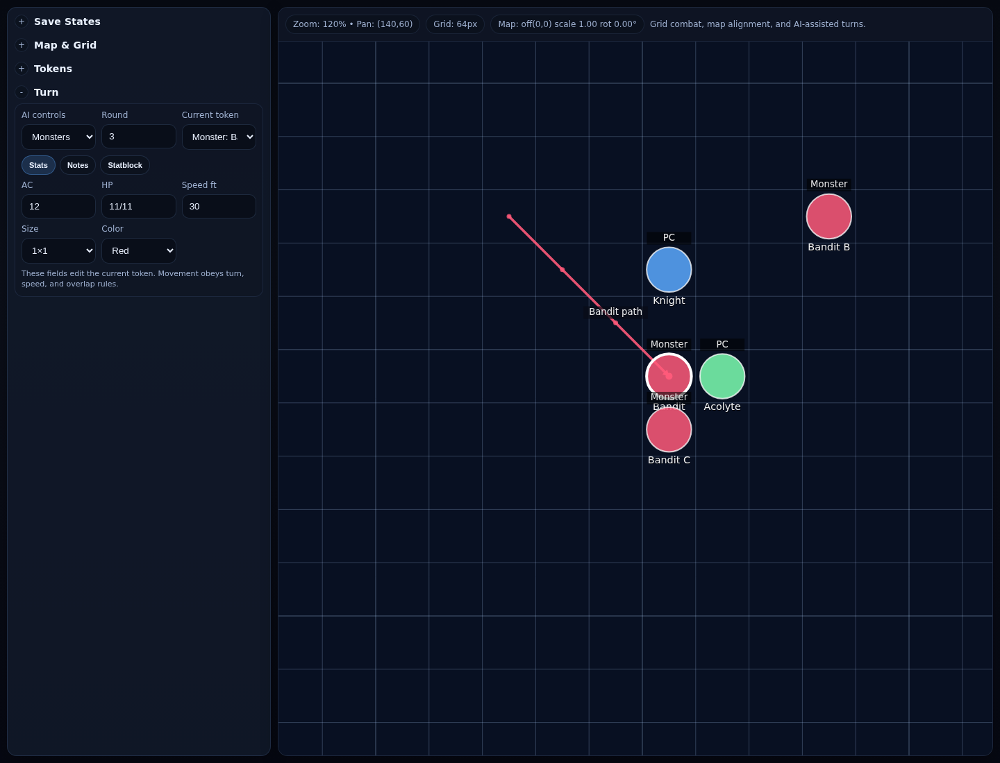
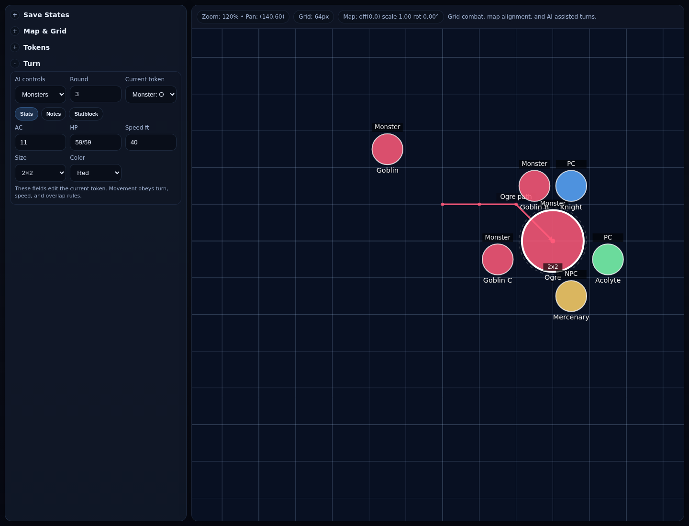
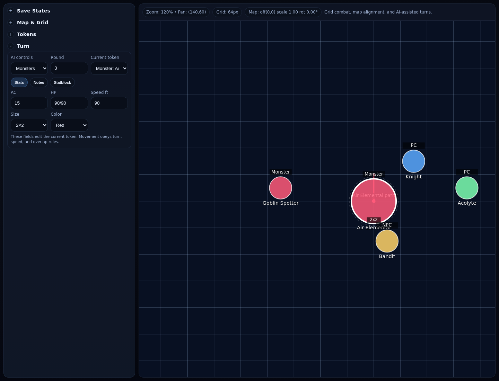
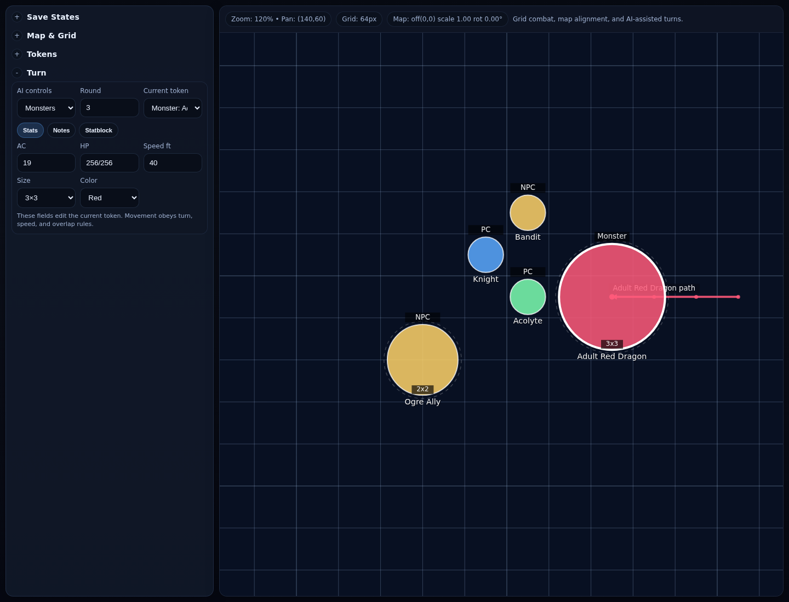
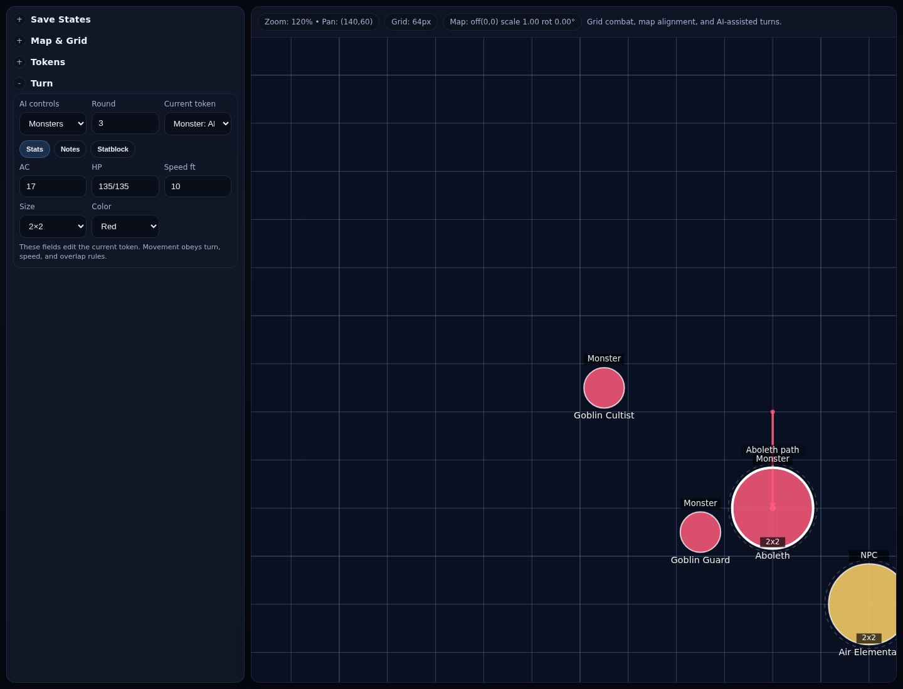

# Benchmark Scenario Gallery

> Representative benchmark boards with scenario-specific latency takeaways.

Each screenshot below shows one benchmark scenario from the GPT-5 packet latency test suite. The caption under each image summarizes which packet variant won that scenario and how far ahead it finished compared with the `full` baseline.

## `duel-goblin-vs-acolyte`

**Winner:** `compact_moves5_attacks6_summary` at **23.31s** average TAT.

**Delta vs `full`:** **17.08s faster** than `full` (40.39s).

**Runner-up:** `compact_summary` at **26.35s** average TAT.

**Finding:** Small duel scenario. Compact variants were dramatically faster here; the best run class cut average TAT by roughly 17 seconds versus `full`.

---

## `ranged-bandit-crossfire`

**Winner:** `compact_summary` at **25.48s** average TAT.

**Delta vs `full`:** **5.34s faster** than `full` (30.82s).

**Runner-up:** `compact_moves5_summary` at **25.84s** average TAT.

**Finding:** Spread-out ranged skirmish. Summarized compact packets performed best here, suggesting lighter token context can help when the board is simple but not crowded.

---

## `crowded-ogre-frontline`

**Winner:** `full` at **47.58s** average TAT.

**Delta vs `full`:** `full` was the fastest variant here at **47.58s**.

**Runner-up:** `compact_moves5_attacks6` at **49.43s** average TAT.

**Finding:** Dense melee congestion case. This was the clearest counterexample to “smaller packet is always faster”: `full` was the fastest average performer.

---

## `air-elemental-flank`

**Winner:** `compact_moves5` at **44.50s** average TAT.

**Delta vs `full`:** **18.67s faster** than `full` (63.17s).

**Runner-up:** `compact_moves5_attacks6` at **47.10s** average TAT.

**Finding:** High-mobility flanking board. `compact_moves5` was the best average latency performer here, beating `full` by about 18.7 seconds.

---

## `boss-dragon-vs-party`

**Winner:** `compact_moves5_attacks6` at **37.41s** average TAT.

**Delta vs `full`:** **18.43s faster** than `full` (55.84s).

**Runner-up:** `compact_moves5_summary` at **40.48s** average TAT.

**Finding:** Boss-turn stress case with a large statblock. `compact_moves5_attacks6` won this scenario on latency, showing that tighter legal move and attack windows can help on heavyweight turns.

---

## `aboleth-control-web`

**Winner:** `compact_moves5` at **34.94s** average TAT.

**Delta vs `full`:** **13.08s faster** than `full` (48.02s).

**Runner-up:** `compact_summary` at **39.81s** average TAT.

**Finding:** Controller-style scenario with a long statblock. `compact_moves5` was clearly best here, implying move pruning can matter more than extra attack-window detail in control-heavy turns.

---

